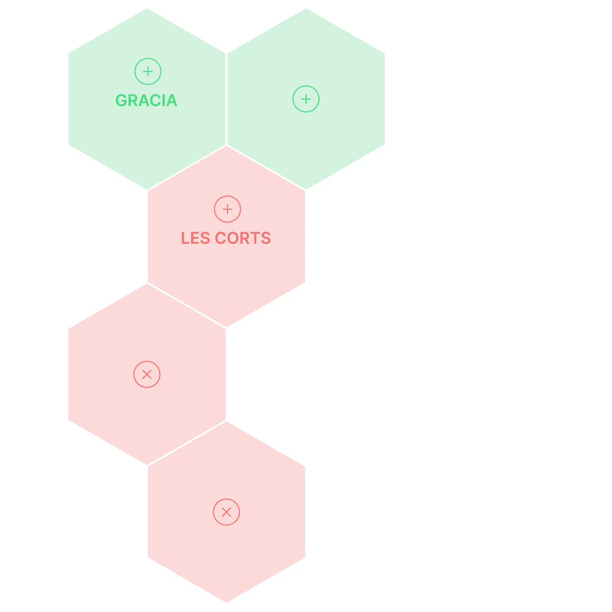

# Welcome to Settlers

Settlers turns your real-world movement into a strategic territory control game. Capture hexagonal territories by visiting locations, join clans, and compete for influence on the global map — all through Telegram.

[:material-rocket: Open game](https://t.me/settlers_hex_bot/game){ .md-button .md-button--primary }
[:material-book-open: Getting Started](guides/getting-started.md){ .md-button }

## Game Guides

- [Getting Started](guides/getting-started.md) — Learn the basics and capture your first territories.
- [Game Mechanics](guides/game-mechanics.md) — Hex states, capture mechanics, and cooldown system.
- [Clan System](guides/clan-system.md) — Join or create a clan and grow your influence.
- [Territory System](guides/territory-system.md) — Map layers and territory control.
- [Referral System](guides/referral-system.md) — Invite friends and grow the community.
- [Roadmap](guides/roadmap.md) — Upcoming features and future development.

